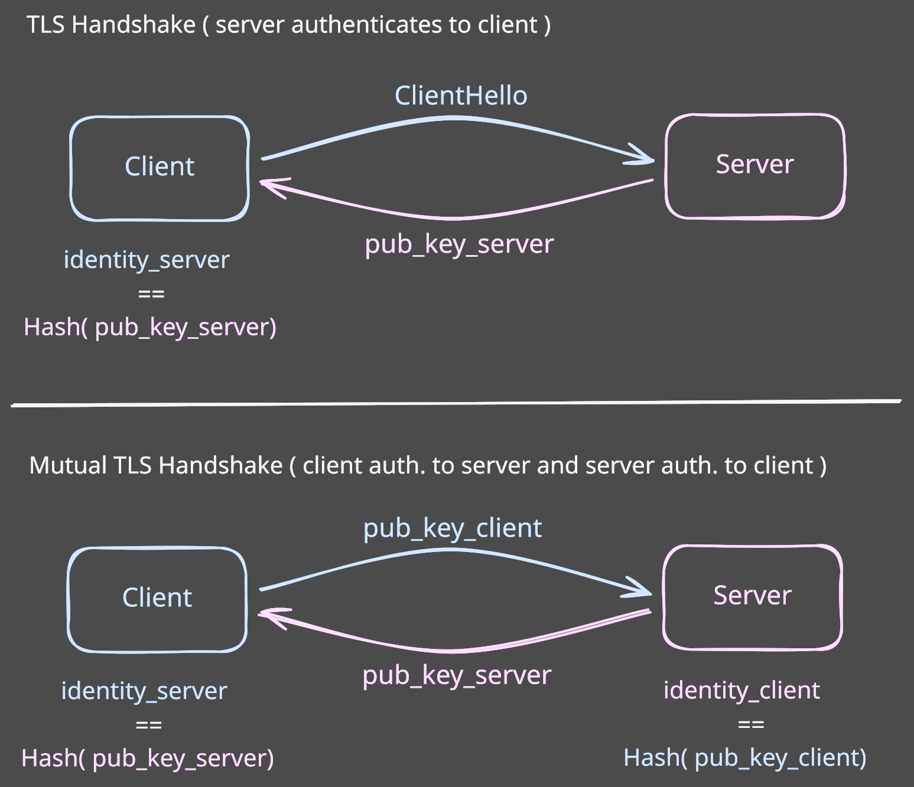

[](https://pkg.go.dev/aead.dev/mtls)

# [m]TLS

A Go library for TLS/HTTPS using public key pinning instead of certificate authorities.

**The Problem**

Usually TLS/HTTPS relies on certificate authorities (CAs) to establish trust. This means:
- Obtaining and renewing certificates from CAs
- Managing certificate chains and trust stores
- Trusting any certificate signed by a trusted CA

For services that communicate with known peers, for example a web and DB server, this is overkill.

**The Solution**

This library takes an SSH-like approach to TLS authentication. Just like SSH's `known_hosts` file lets you trust
specific server keys directly, `mtls` lets you identify peers by their public key hash rather than CA signatures.

```
h1:2eYrKRe4K9Xf_HjOhdJjNPuH5P8sLN9XNgdgZKfqt1A
```

That's it. No certificates to issue, no chains to verify, no CAs to manage.

## Getting Started

```sh
go get aead.dev/mtls@latest
```

This downloads the `mtls` module. It has no dependencies.

Add the `aead.dev/mtls` module to your `go.mod` file.
The documentation contains [examples](https://pkg.go.dev/aead.dev/mtls#example-package) on how to configure clients and servers.

## How It Works

1. Generate a private/public key pair.
2. Peers exchange identities (SHA-256 hash of public key) out-of-band.
   For example, as part of their configuration.
3. During the TLS handshake, one or both sides verify that the other's public key matches the expected identity.


